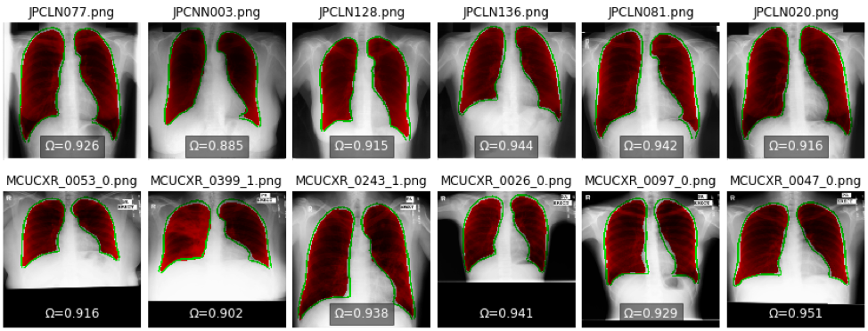
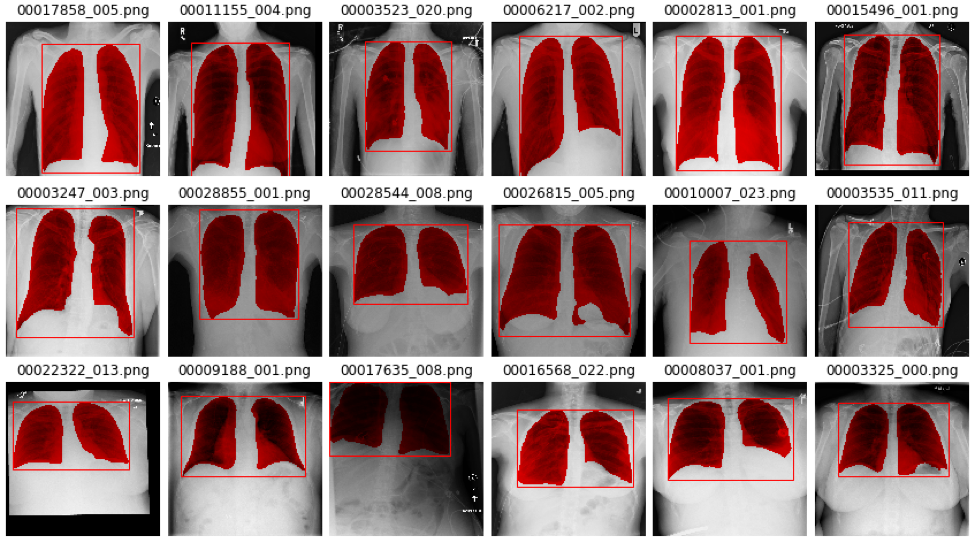

##  Lung Segmentation and Thoracic Classification using Deep Learning

- This is my project for Thoracic Classification using explicit attention mechanism by lung segmentation on ChestX-ray-14 dataset for 14 different lung diseases (i.e. Atelectasis, Cardiomegaly, Effusion, Infiltration, Mass, Nodule, Pneumonia, Pneumothorax, Consolidation, Edema, Emphysema, Fibrosis, Pleural Thickening, and Hernia).
- Segmentation Guided Thoracic Classification.

## Architecture

- Lung segmentation use a modified version of ResNet with U-net liked decoder path.
- Thoracic classification use DenseNet-121.

## Prerequisites
- Python 3.6+ (I use f-format string)
- Pytorch 1.0.0
- Fastai, I used this [branch](https://github.com/fastai/fastai/tree/45e9c480b82371db759586606adb03a71704fd8b) and create symbolic link from fastai/old/fastai to src/fastai directory
- CheXNet and Unet models are in models directory
- Start by looking at [src/chexnet.py](src/chexnet.py), [src/unet.py](src/unet.py) and [src/server.py](src/server.py)

## Dataset
- NIH ChestX-ray Dataset with 112,120 images from 30,805 patients for classification, the dataset can be downloaded
[here](https://www.kaggle.com/nih-chest-xrays/data).
- JSRT (Japanese Society of Radiological Technology) and MC (Montgomery County) for lung segmentation. JSRT can be
  downloaded [here](http://db.jsrt.or.jp/eng.php) with [SCR mask](http://www.isi.uu.nl/Research/Databases/SCR/), MC dataset can be downloaded [here](https://ceb.nlm.nih.gov/repositories/tuberculosis-chest-x-ray-image-data-sets/).

## Result

- Lung Segmentation result on **Top**: JSRT dataset, **Bottom**: MC dataset. The green contour indicates the ground truth and
  the red mask indicates the predicted mask. Ω denotes the IoU value.

- Lung segmentation on ChestX-ray 14 dataset.

- Comparision

|Method |Atel |Card |Effu |Infi |Mass |Nodu |Pne1 |Pne2 |Cons |Edem |Emp  |Fibr |PT   |Hern |Mean |
|----------------|-----|-----|-----|-----|-----|-----|-----|-----|-----|-----|-----|-----|-----|-----|-----|
|Yao et la.      |0.772|0.904|0.859|0.695|0.792|0.717|0.713|0.841|0.788|0.882|0.829|0.767|0.765|0.914|0.803|
|Rajpurkar et la.|0.809|0.925|0.864|0.735|0.867|0.78 |0.768|0.889|0.79 |0.888|0.937|0.805|0.806|0.916|0.841|
|Guan et la.     |0.853|0.939|0.903|0.754|0.902|0.828|0.774|0.921|0.842|0.924|0.932|0.864|0.837|0.921|0.871|
|Mine            |0.831|0.918|0.883|0.712|0.859|0.789|0.765|0.88 |0.813|0.899|0.911|0.826|0.782|0.943|0.843|

> Each pathology is denoted with its first four characteristics, e.g., Atelectasis with Atel. Pneumonia and Pneumothorax are denoted as Pneu1 and Pneu2, respectively. PT represents Pleural Thickening

## Demo

## Reference

- X. Wang, Y. Peng, L. Lu, Z. Lu, M. Bagheri, and R. M. Summers, “ChestX-ray8: Hospital-scale Chest X-ray Database and Benchmarks on Weakly-Supervised Classification and Localization of Common Thorax Diseases,” ArXiv170502315 Cs, May 2017.
- P. Rajpurkar et al., “CheXNet: Radiologist-Level Pneumonia Detection on Chest X-Rays with Deep Learning,” ArXiv171105225 Cs Stat, Nov. 2017.
- L. Yao, E. Poblenz, D. Dagunts, B. Covington, D. Bernard, and K. Lyman, “Learning to diagnose from scratch by exploiting dependencies among labels,” ArXiv171010501 Cs, Oct. 2017.
- Q. Guan, Y. Huang, Z. Zhong, Z. Zheng, L. Zheng, and Y. Yang, “Diagnose like a Radiologist: Attention Guided Convolutional Neural Network for Thorax Disease Classification,” Jan. 2018.
